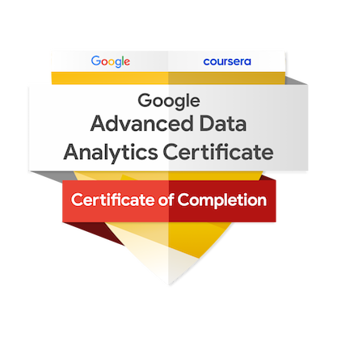

# 👋 Hi I'm Rutuja Chauhan!

I bring extensive expertise as a Data Engineer and Analyst, specializing in converting data into actionable insights. I possess proficiency in Python, Databricks, Vertex AI, as well as Azure and Google Cloud Services. My skills encompass data cleaning, modeling, and the creation of insightful dashboards tailored for data-driven decision-making. I have a robust foundation in statistics and machine learning, complemented by strong analytical and problem-solving capabilities.

***

<h3 style="text-align:center;"> 📝 Skills

    💻 Programming: Python, SQL

    ☁️ Cloud Platforms: Azure & Google Cloud Services.

    🔍 Visualization: Power BI, Looker Studio, Appache SuperSet

    📈 Analysis: Statistics, Machine Learning

    🤖 Generative AI: Vertex AI (Google gemini-vision pro, PALM2 etc. )
*** 

<h3 style="text-align:center;"> 📜 Certificates

    
    
    
    

*** 

<h3 style="text-align:center;"> 🏅 Badges

    
    

*** 

<h3 style="text-align:center;">  🤝 Connect with me

    
    
    

